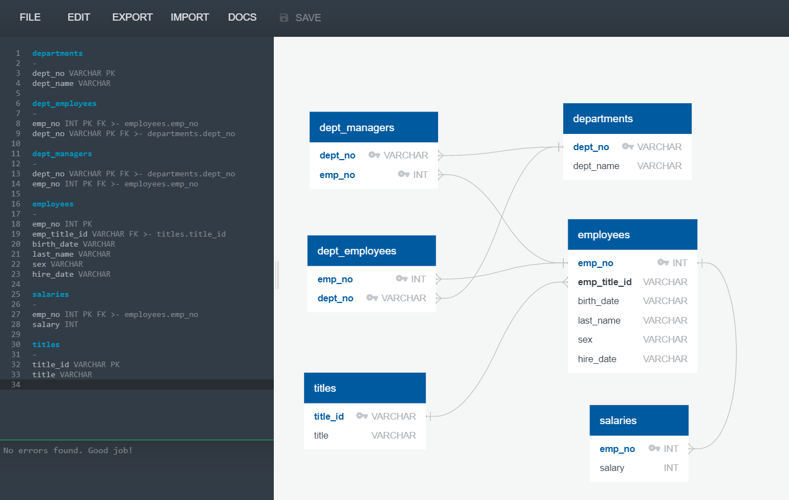
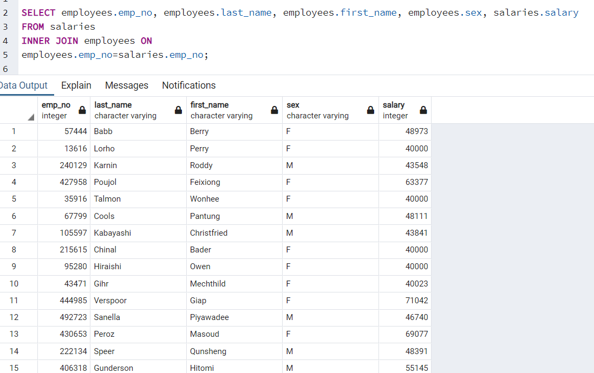
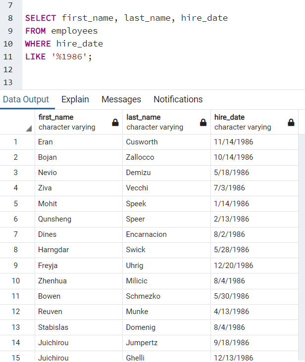
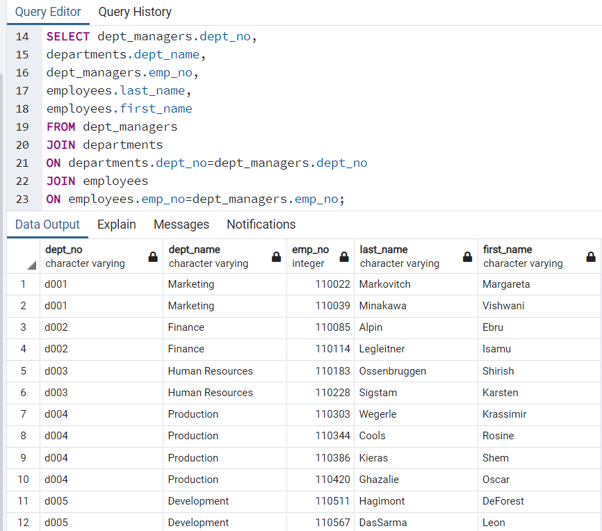
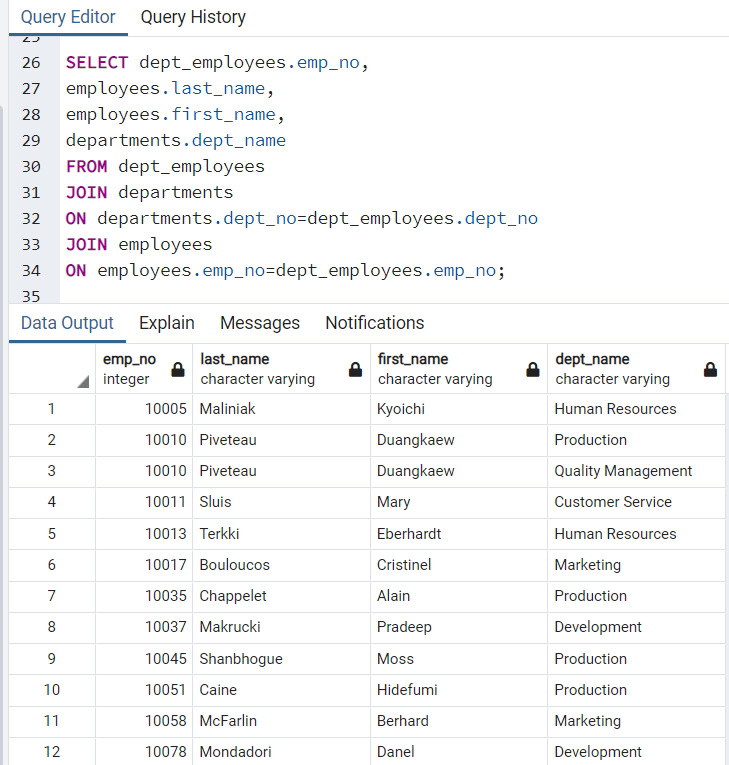
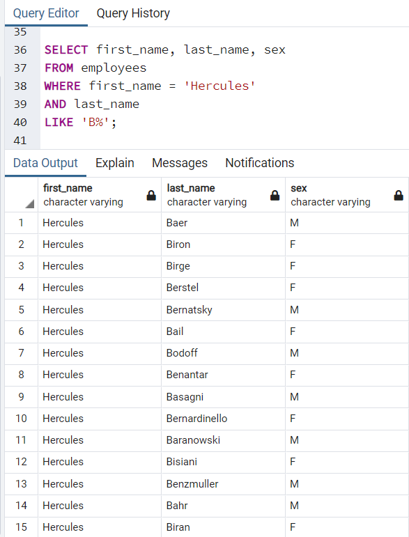
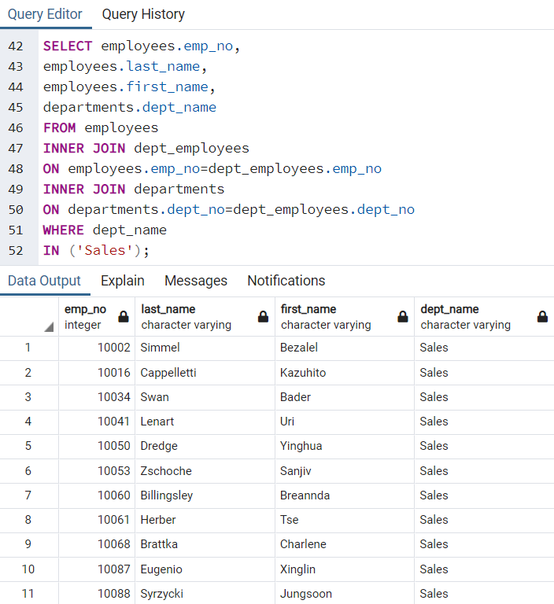
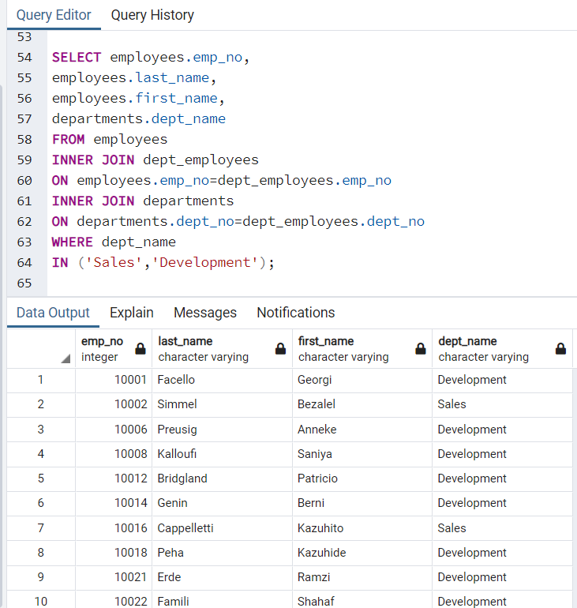
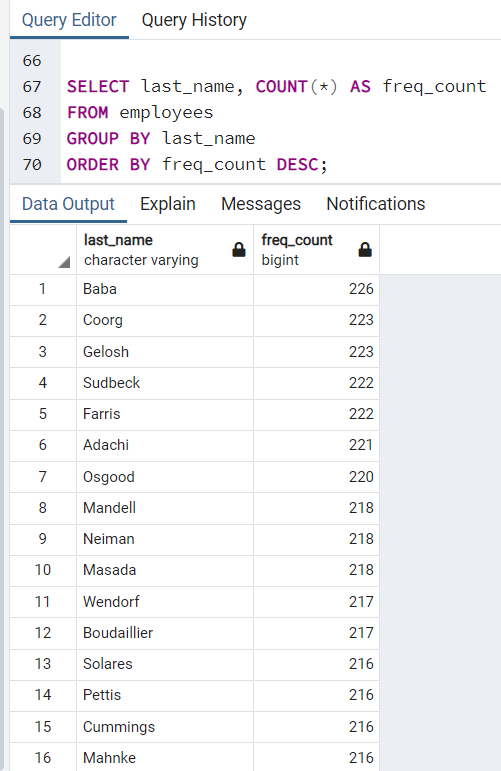

# Introduction

For this project I used mock employee data contained within six CSV files to create an SQL database. In order to do this, I designed tables to hold the data in the CSVs and imported the CSVs into a SQL database. Once this was complete, I was able to run queries to answer questions about the data.

# Data Modeling
Inspect the CSVs and sketch out an ERD of the tables. Feel free to use a tool like http://www.quickdatabasediagrams.com. The ERD for this project can be found in the ERD.png file, located in the EmployeeSQL folder.

# Data Engineering
Use the information you have to create a table schema for each of the six CSV files. Remember to specify data types, primary keys, foreign keys, and other constraints. For the primary keys check to see if the column is unique, otherwise create a composite key. Which takes to primary keys in order to uniquely identify a row. Be sure to create tables in the correct order to handle foreign keys.

For this project, the tables schema can be found in the table_schema.sql file, located in the EmployeeSQL folder.

Import each CSV file into the corresponding SQL table. Note be sure to import the data in the same order that the tables were created and account for the headers when importing to avoid errors. 

The CSVs used for this project can be found in the EmployeeSQL folder, within the Data folder. The code used to load each CSV file into an SQL table can be found in the EmployeeSQL folder, within the sql-tables.sql file.

# Data Analysis
Once you have a complete database, do the following:

1. List the following details of each employee: employee number, last name, first name, sex, and salary.

2. List first name, last name, and hire date for employees who were hired in 1986.

3. List the manager of each department with the following information: department number, department name, the manager's employee number, last name, first name.

4. List the department of each employee with the following information: employee number, last name, first name, and department name.

5. List first name, last name, and sex for employees whose first name is "Hercules" and last names begin with "B."

6. List all employees in the Sales department, including their employee number, last name, first name, and department name.

7. List all employees in the Sales and Development departments, including their employee number, last name, first name, and department name.

8. In descending order, list the frequency count of employee last names, i.e., how many employees share each last name.

The SQL code for these queries can be found in the EmployeeSQL folder, in the [queries.sql](queries.sql) file.
